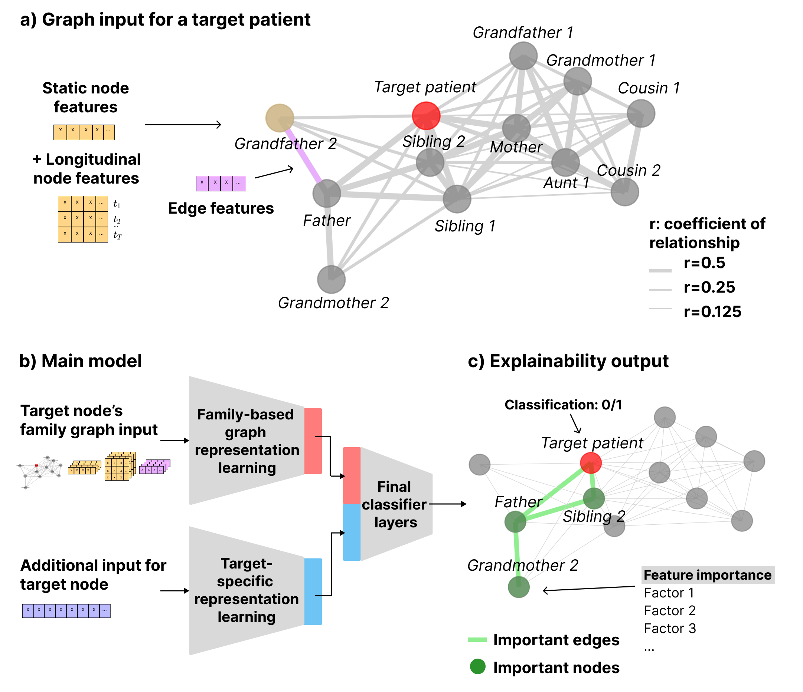

# Graph representation learning for familial relationships

This repository contains code for running the models presented in the manuscript ["Characterizing personalized effects of family information on disease risk using graph representation learning"](https://arxiv.org/abs/2304.05010).

Code authors: Sophie Wharrie, Zhiyu Yang

## Overview of method



a) Graph data structure for longitudinal EHRs of the target individual and their relatives

b) GNN and LSTM based classifier predicts health outcomes in the target cohort

c) Graph explainability identifies important nodes, edges and features from relatives for predicting disease risk in the target individual

## Software dependencies

###  Python conda environment

See `environment.yml` for full details of packages and versions used in our experiments

```
conda create --name graphml
conda activate graphml

conda install pytorch==1.12.1 torchvision==0.13.1 torchaudio==0.12.1 cudatoolkit=10.2 -c pytorch
pip install pyg-lib torch-scatter torch-sparse -f https://data.pyg.org/whl/torch-1.12.0+cu102.html
pip install torch-geometric
conda install -c conda-forge torchmetrics
conda install matplotlib
pip install networkit
conda install -c anaconda seaborn
pip install torch-cluster -f https://data.pyg.org/whl/torch-1.12.0+cu102.html
```

## Synthetic data

The experiments in the paper use a nationwide health registry dataset, which cannot be publicly shared for data privacy reasons. Therefore, we provide code and instructions in the `data_simulator` directory for generating (non-longitudinal) synthetic datasets that mimic the key properties of the real dataset. An example of a synthetic dataset in the input format expected by the ML models is available in the `test` directory.

## Data inputs

The model requires 4 input files:
- **Maskfile**: Specifies which samples belong to the target cohort (patients to predict health outcomes for) and which samples belong to the graph cohort (relatives of the target patients). This file also specifies the train, validation and test split for the dataset. 
- **Statfile**: Contains the (static node) feature dataset for all samples in both the target and graph cohorts. This file also contains the data for the label being predicted for the binary classification task.
- **Featfile**: Specifies which features to use for training the model, for 4 types of features: `static`, `longitudinal`, `label` and `edge`.
- **Edgefile**: Contains the edge pairs for the family graphs, where each patient in the target cohort has a separate family graph. This file also contains the data for the edge features.

See details for the format of each file type below.

### Maskfile

Each row of the file represents a patient, with the following column structure:
- PATIENTID: A unique (string or float) identifier for the patient. Doesn't follow any formatting requirements, so it can be specific to your dataset
- train: Specifies whether the patient is in the train/validation/test sets. Possible values are 0=train, 1=validation, 2=test, -1=ignore. Non-target patients should be set to -1
- graph: Specifies whether the patient is a graph sample, i.e., a target sample or a relative of at least one target sample. Possible values are 1=graph patient, 0=non-graph patient 
- target: Specifies whether the patient is a target sample, i.e., the set of patients for which the algorithm is learning to predict health outcomes. Possible values are 1=target patient, 0=non-target patient
- node_id: A unique identifier for the patient, indexed from 0, in ascending order, i.e., 0, 1, ...

Example:

| PATIENTID | train | graph | target | node_id |
|---|---|---|---|---|
| ID0001 | 0 | 1 | 1 | 0 |
| ID0002 | 1 | 1 | 1 | 1 |
| ID0003 | 2 | 1 | 1 | 2 |
| ID0004 | -1 | 1 | 0 | 3 |
| ID0005 | -1 | 1 | 0 | 4 |

### Featfile

Each row of the file represents a feature in the dataset, with the following column structure:
- name:  The name of the feature. Note: `static` and `label` feature names should exist as columns in the `Statfile`, `edge` feature names should exist as columns in the `Edgefile`. See the note in the Models section for `longitudinal` features.
- type: The feature type, with possible values being `label`, `static`, `longitudinal` and `edge`. The `static` and `longitudinal` features correspond to different types of node features in the graph, the `edge` features correspond to edge features (weights) in the graph, and the `label` corresponds to the variable being predicted

Example: 

| name | type |
|---|---|
|healthOutcome|label|
|age|static|
|sex|static|
|medicalHistory|static|
|relatednessWeight|edge|

See the `test/featfiles` directory for examples of feature files for each of the models used for the experiments in the paper.

### Statfile

Each row represents the feature and label data for a patient. The only required columns are `PATIENTID` (corresponding to the same patient identifiers used in the `Maskfile`) and a column for the (binary classification) label. Other columns for the features can use any names that you want and if a column name isn't specified in the `Featfile` then the code will ignore the feature during training. The `Statfile` should include all the same patients and in the same order as the `Maskfile`. 

Example:

| PATIENTID | healthOutcome | age | sex | medicalHistory |
|---|---|---|---|---|
| ID0001 | 0 | 34 | 1 | 0 |
| ID0002 | 1 | 43 | 0 | 0 |
| ID0003 | 0 | 24 | 1 | 0 |
| ID0004 | 1 | 50 | 1 | 1 |
| ID0005 | 0 | 65 | 0 | 0 |

### Edgefile

Each row represents an edge pair in a target patient's (undirected) family graph, with the following column structure:
- node1: The identifier for the first patient in the edge pair, corresponding to a `node_id` from the `Maskfile`
- node2: The identifier for the second patient in the edge pair, corresponding to a `node_id` from the `Maskfile`
- target_patient: The identifier for the target patient, corresponding to a `node_id` from the `Maskfile`. The code assumes that the edge `(node1, node2)` belongs to the family graph for this target patient
- weight: The edge weight
- ... (additional columns for edge features are optional)

Example:

| node1 | node2 | target_patient | weight |
|---|---|---|---|
| 0 | 1 | 0 | 0.5 | 
| 0 | 3 | 0 | 0.25 | 
| 1 | 0 | 1 | 0.5 | 
| 1 | 2 | 1 | 0.25 |
| 1 | 4 | 1 | 0.25 | 
| 2 | 4 | 1 | 0.5 |

## Models

The models can be run using the `src/main.py` script. The following (command line) scripts show how to reproduce a full experiment run for the GNN methods and deep learning baselines used in experiments, for the example (synthetic) dataset in the `test` directory.

Model outputs:
- ...model.pth: PyTorch model file
- ...loss.png: plots of training and validation losses for each epoch of training
- ...results.csv: actual and predicted values for the test dataset
- ...stats.csv: summary statistics including full list of hyperparameters used and evaluation metric values calculated for the test dataset

:warning: **IMPORTANT NOTE for longitudinal models:** In our experiments we used a SQLite backend to store and load large longitudinal EHR datasets that don't fit in memory. If you are using the longitudinal models, you should first update the code to connect your own dataset, i.e. by updating the code in `src/data.py`. For testing purposes, the scripts provided below use the `--local_test` flag to simulate random values for models that require longitudinal data.

### Setup

The hyperparameter values used in experiments are printed below. This can be run as a command line script before running the individual model scripts provided in the following sections. Note that not all hyperparameters are required for all models. See `main.py` for descriptions of the hyperparameters.

```
outpath=results
mkdir -p $outpath
endpoint=TestDisease

statfile=test/Gen3_50k_0.7_142857_statfile.csv
maskfile=test/Gen3_50k_0.7_142857_maskfile.csv
edgefile=test/Gen3_50k_0.7_142857_edgefile.csv

# these are the values used in the real data experiments - they can be changed if you want
gnn_layer=graphconv
pooling_method=target
obs_window_start=1990
obs_window_end=2010
num_workers=1 # increase to execute code faster
batchsize=250
max_epochs=100
patience=5
learning_rate=0.001
main_hidden_dim=20 # used for both GNN and MLP
lstm_hidden_dim=20 # x2 for bidirectional LSTM
gamma=1
alpha=1
beta=1
delta=1
dropout_rate=0.5
device=na # this will use GPU by default, change the value to cpu if you don't want this
```


### Age and sex MLP (A1)

An MLP for age and sex features only. Corresponds to the feature file `test/featfiles/featfile_A1.csv`

```
featfile=test/featfiles/featfile_A1.csv
model_type=baseline
experiment=a1_${endpoint}
loss='bce_weighted_single'
python3 ./src/main.py --featfile ${featfile} --model_type ${model_type} --experiment ${experiment} --batchsize ${batchsize} --outpath ${outpath} --statfile ${statfile} --maskfile ${maskfile} --edgefile ${edgefile} --gnn_layer ${gnn_layer} --pooling_method ${pooling_method} --obs_window_start ${obs_window_start} --obs_window_end ${obs_window_end} --num_workers ${num_workers} --max_epochs ${max_epochs} --patience ${patience} --learning_rate ${learning_rate} --main_hidden_dim ${main_hidden_dim} --lstm_hidden_dim ${lstm_hidden_dim} --loss ${loss} --gamma ${gamma} --alpha ${alpha} --beta ${beta} --delta ${delta} --dropout_rate ${dropout_rate} --device ${device}
```

### Age, sex and family history MLP (A2)

An MLP for age, sex and family history features. Corresponds to the feature file `test/featfiles/featfile_A2.csv`

```
featfile=test/featfiles/featfile_A2.csv
model_type=baseline
experiment=A2_${endpoint}
loss='bce_weighted_single'
python3 ./src/main.py --featfile ${featfile} --model_type ${model_type} --experiment ${experiment} --batchsize ${batchsize} --outpath ${outpath} --statfile ${statfile} --maskfile ${maskfile} --edgefile ${edgefile} --gnn_layer ${gnn_layer} --pooling_method ${pooling_method} --obs_window_start ${obs_window_start} --obs_window_end ${obs_window_end} --num_workers ${num_workers} --max_epochs ${max_epochs} --patience ${patience} --learning_rate ${learning_rate} --main_hidden_dim ${main_hidden_dim} --lstm_hidden_dim ${lstm_hidden_dim} --loss ${loss} --gamma ${gamma} --alpha ${alpha} --beta ${beta} --delta ${delta} --dropout_rate ${dropout_rate} --device ${device}
```

### Age, sex and graph connectivity MLP (A3)

An MLP for age, sex and topological information (8-dimensional Node2Vec embedding for each patient generated from the connected family network for the entire dataset). Corresponds to the feature file `test/featfiles/featfile_A3.csv`

```
featfile=test/featfiles/featfile_A3.csv
model_type=baseline
experiment=A3_${endpoint}
loss='bce_weighted_single'
python3 ./src/main.py --featfile ${featfile} --model_type ${model_type} --experiment ${experiment} --batchsize ${batchsize} --outpath ${outpath} --statfile ${statfile} --maskfile ${maskfile} --edgefile ${edgefile} --gnn_layer ${gnn_layer} --pooling_method ${pooling_method} --obs_window_start ${obs_window_start} --obs_window_end ${obs_window_end} --num_workers ${num_workers} --max_epochs ${max_epochs} --patience ${patience} --learning_rate ${learning_rate} --main_hidden_dim ${main_hidden_dim} --lstm_hidden_dim ${lstm_hidden_dim} --loss ${loss} --gamma ${gamma} --alpha ${alpha} --beta ${beta} --delta ${delta} --dropout_rate ${dropout_rate} --device ${device}
```

### Age, sex and longitudinal EHR data LSTM (A4)

(:warning: - see note for longitudinal models) A combined MLP-LSTM model that in addition to age and sex features, includes a single-layer. bidirectional LSTM for longitudinal EHR data. Corresponds to the feature file `test/featfiles/featfile_A4.csv`. Note that the script uses the `--local_test` flag.

```
featfile=test/featfiles/featfile_A4.csv
model_type=baseline
experiment=A4_${endpoint}
loss='bce_weighted_single'
python3 ./src/main.py --featfile ${featfile} --model_type ${model_type} --experiment ${experiment} --batchsize ${batchsize} --outpath ${outpath} --statfile ${statfile} --maskfile ${maskfile} --edgefile ${edgefile} --gnn_layer ${gnn_layer} --pooling_method ${pooling_method} --obs_window_start ${obs_window_start} --obs_window_end ${obs_window_end} --num_workers ${num_workers} --max_epochs ${max_epochs} --patience ${patience} --learning_rate ${learning_rate} --main_hidden_dim ${main_hidden_dim} --lstm_hidden_dim ${lstm_hidden_dim} --loss ${loss} --gamma ${gamma} --alpha ${alpha} --beta ${beta} --delta ${delta} --dropout_rate ${dropout_rate} --device ${device} --local_test
```

### Age, sex, family history and longitudinal EHR data LSTM (A5)

(:warning: - see note for longitudinal models) A combined MLP-LSTM model that in addition to age, sex and family history features, includes a single-layer. bidirectional LSTM for longitudinal EHR data. Corresponds to the feature file `test/featfiles/featfile_A5.csv`. Note that the script uses the `--local_test` flag.

```
featfile=test/featfiles/featfile_A5.csv
model_type=baseline
experiment=A5_${endpoint}
loss='bce_weighted_single'
python3 ./src/main.py --featfile ${featfile} --model_type ${model_type} --experiment ${experiment} --batchsize ${batchsize} --outpath ${outpath} --statfile ${statfile} --maskfile ${maskfile} --edgefile ${edgefile} --gnn_layer ${gnn_layer} --pooling_method ${pooling_method} --obs_window_start ${obs_window_start} --obs_window_end ${obs_window_end} --num_workers ${num_workers} --max_epochs ${max_epochs} --patience ${patience} --learning_rate ${learning_rate} --main_hidden_dim ${main_hidden_dim} --lstm_hidden_dim ${lstm_hidden_dim} --loss ${loss} --gamma ${gamma} --alpha ${alpha} --beta ${beta} --delta ${delta} --dropout_rate ${dropout_rate} --device ${device} --local_test
```

### Graph model, no longitudinal data (G1)

The GNN model for non-longitudinal data. Corresponds to the feature files `test/featfiles/featfile_G1.csv` (for the family component) and `test/featfiles/featfile_A2.csv` (for the target component).

```
featfile=test/featfiles/featfile_G1.csv # for family
alt_featfile=test/featfiles/featfile_A2.csv # for target
model_type=graph
experiment=G1_${endpoint}
loss='bce_weighted_sum'

python3 ./src/main.py --featfile ${featfile} --model_type ${model_type} --experiment ${experiment} --batchsize ${batchsize} --alt_featfile ${alt_featfile} --outpath ${outpath} --statfile ${statfile} --maskfile ${maskfile} --edgefile ${edgefile} --gnn_layer ${gnn_layer} --pooling_method ${pooling_method} --obs_window_start ${obs_window_start} --obs_window_end ${obs_window_end} --num_workers ${num_workers} --max_epochs ${max_epochs} --patience ${patience} --learning_rate ${learning_rate} --main_hidden_dim ${main_hidden_dim} --lstm_hidden_dim ${lstm_hidden_dim} --loss ${loss} --gamma ${gamma} --alpha ${alpha} --beta ${beta} --delta ${delta} --dropout_rate ${dropout_rate} --device ${device}
```

### Graph model, with longitudinal data (G2)

(:warning: - see note for longitudinal models) The GNN model for longitudinal data. Corresponds to the feature files `test/featfiles/featfile_G2.csv` (for the family component) and `test/featfiles/featfile_A5.csv` (for the target component). Note that the script uses the `--local_test` flag.

```
featfile=test/featfiles/featfile_G2.csv # for family
alt_featfile=test/featfiles/featfile_A5.csv # for target
model_type=graph
experiment=G2_${endpoint}
loss='bce_weighted_sum'

python3 ./src/main.py --featfile ${featfile} --model_type ${model_type} --experiment ${experiment} --batchsize ${batchsize} --alt_featfile ${alt_featfile} --outpath ${outpath} --statfile ${statfile} --maskfile ${maskfile} --edgefile ${edgefile} --gnn_layer ${gnn_layer} --pooling_method ${pooling_method} --obs_window_start ${obs_window_start} --obs_window_end ${obs_window_end} --num_workers ${num_workers} --max_epochs ${max_epochs} --patience ${patience} --learning_rate ${learning_rate} --main_hidden_dim ${main_hidden_dim} --lstm_hidden_dim ${lstm_hidden_dim} --loss ${loss} --gamma ${gamma} --alpha ${alpha} --beta ${beta} --delta ${delta} --dropout_rate ${dropout_rate} --device ${device} --local_test
```

## Explainability analysis

(:warning: - see note for longitudinal models) The explainability analysis is implemented for GNN-LSTM models. Outputs include `...nodes.csv` for node and node feature explainability, `...edges.csv` for edge explainability, and `...embeddings.csv` for the graph embeddings output.

Instructions:

1. Train a GNN-LSTM model for explainability analysis, by setting `model_type=explainability`

```
featfile=test/featfiles/featfile_G2.csv # for family
alt_featfile=test/featfiles/featfile_A5.csv # for target
model_type=explainability
experiment=explainability_${endpoint}
loss='bce_weighted_sum'

python3 ./src/main.py --featfile ${featfile} --model_type ${model_type} --experiment ${experiment} --batchsize ${batchsize} --alt_featfile ${alt_featfile} --outpath ${outpath} --statfile ${statfile} --maskfile ${maskfile} --edgefile ${edgefile} --gnn_layer ${gnn_layer} --pooling_method ${pooling_method} --obs_window_start ${obs_window_start} --obs_window_end ${obs_window_end} --num_workers ${num_workers} --max_epochs ${max_epochs} --patience ${patience} --learning_rate ${learning_rate} --main_hidden_dim ${main_hidden_dim} --lstm_hidden_dim ${lstm_hidden_dim} --loss ${loss} --gamma ${gamma} --alpha ${alpha} --beta ${beta} --delta ${delta} --dropout_rate ${dropout_rate} --device ${device} --local_test
```

2. Run the explainability analysis on the trained model, by using the `--explainability_mode` flag. The number of samples to include in the explainability analysis is set using the `--num_positive_samples` option. Specifically, this number of case samples and the same number of control samples are randomly sampled from the test set for analysis

```
featfile=test/featfiles/featfile_G2.csv # for family
alt_featfile=test/featfiles/featfile_A5.csv # for target
model_type=explainability
experiment=explainability_${endpoint}
loss='bce_weighted_sum'
num_positive_samples=500

python3 ./src/main.py --featfile ${featfile} --model_type ${model_type} --experiment ${experiment} --batchsize ${batchsize} --alt_featfile ${alt_featfile} --outpath ${outpath} --statfile ${statfile} --maskfile ${maskfile} --edgefile ${edgefile} --gnn_layer ${gnn_layer} --pooling_method ${pooling_method} --obs_window_start ${obs_window_start} --obs_window_end ${obs_window_end} --num_workers ${num_workers} --max_epochs ${max_epochs} --patience ${patience} --learning_rate ${learning_rate} --main_hidden_dim ${main_hidden_dim} --lstm_hidden_dim ${lstm_hidden_dim} --loss ${loss} --gamma ${gamma} --alpha ${alpha} --beta ${beta} --delta ${delta} --dropout_rate ${dropout_rate} --device ${device} --num_positive_samples ${num_positive_samples} --local_test --explainability_mode
```

3. Optionally, you can also store the graph embeddings for the samples used in the explainability analysis (e.g. for clustering analysis), by using the `--embeddings_mode` flag. Note that the `explainer_input` file (created in the previous step) needs to be specified

```
featfile=test/featfiles/featfile_G2.csv # for family
alt_featfile=test/featfiles/featfile_A5.csv # for target
model_type=explainability
experiment=explainability_${endpoint}
loss='bce_weighted_sum'
explainer_input=${outpath}/explainability_${endpoint}_explainer_nodes.csv

python3 ./src/main.py --featfile ${featfile} --model_type ${model_type} --experiment ${experiment} --batchsize ${batchsize} --alt_featfile ${alt_featfile} --outpath ${outpath} --statfile ${statfile} --maskfile ${maskfile} --edgefile ${edgefile} --gnn_layer ${gnn_layer} --pooling_method ${pooling_method} --obs_window_start ${obs_window_start} --obs_window_end ${obs_window_end} --num_workers ${num_workers} --max_epochs ${max_epochs} --patience ${patience} --learning_rate ${learning_rate} --main_hidden_dim ${main_hidden_dim} --lstm_hidden_dim ${lstm_hidden_dim} --loss ${loss} --gamma ${gamma} --alpha ${alpha} --beta ${beta} --delta ${delta} --dropout_rate ${dropout_rate} --device ${device} --explainer_input ${explainer_input} --local_test --embeddings_mode
```

